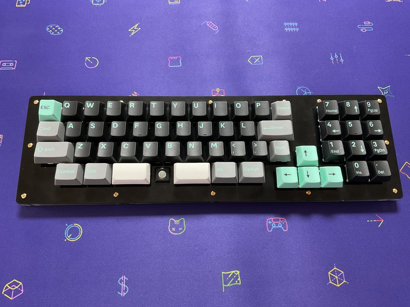

# cool756

 

# What is cool756?

cool756 is designed by m.ki.
 
cool756 is a keyboard.
 
This keyboard has 56 keys or 55keys and trackball.
 
 

# build guide

https://github.com/telzo2000/cool756/blob/main/buildguide_for_cool756.md
 

# firmware

https://github.com/telzo2000/cool756/tree/main/firmware
 
# Sales site

https://mki0002ozlet.booth.pm/items/4491960

