# Build guide(cool756 ver.1.0)

## Parts list

| No. | Patrs | Quantity | remarks | Suppliers | Cost |
|--|--|--|--|--|--|
|番号|名前|数|備考|調達先|参考価格（送料込）| 
|1|PCB|1|50%keyboard keyboard|[elecrow](https://www.elecrow.com) [JLCPCB](https://jlcpcb.com) [ALLPCB](https://www.allpcb.com)|10枚で130〜140ドル| 
|2-1|Switch Plate スイッチプレート|１|↑|↑|↑|
|2-2|Bottom Plate ボトムプレート|１|↑|↑|↑|
|3|M2screw M2ネジ|26|4mm CoverPlateで使用|DIYショップなど|10本で100円程度|
|4|M2spacer M2スペーサー|13|8mmメス-メス|[ヒロスギネット](https://www.hirosugi-net.co.jp/shop/c/c10/) [遊舎工房](https://yushakobo.jp)|20本で800円程度|
|5|pro micro|1|ピンヘッダ含む|[遊舎工房](https://yushakobo.jp) [Talp Keyboard](https://talpkeyboard.net) [Daily Craft Keyboard](https://shop.dailycraft.jp)等|価格変動中|
|6|Swith socket スイッチソケット|56|cherry MX互換 無くても可|[遊舎工房](https://yushakobo.jp) [Talp Keyboard](https://talpkeyboard.net) [Daily Craft Keyboard](https://shop.dailycraft.jp)等|10個で165円程度|
|7|Diode ダイオード|56|リードタイプでもSMDでも可|[遊舎工房](https://yushakobo.jp) [Talp Keyboard](https://talpkeyboard.net) [Daily Craft Keyboard](https://shop.dailycraft.jp)等|100個で220円程度から|

この他に、USBケーブル、キーキャップ等が必要です。

## Firmware

[Here](https://github.com/telzo2000/cool756/tree/main/firmware)

 
[remap](https://remap-keys.app/)

 

## Build

Please read it and then work on it.
 
一読してから、作業をしてください。
  

### 1 Parts check

Front side（表面） 
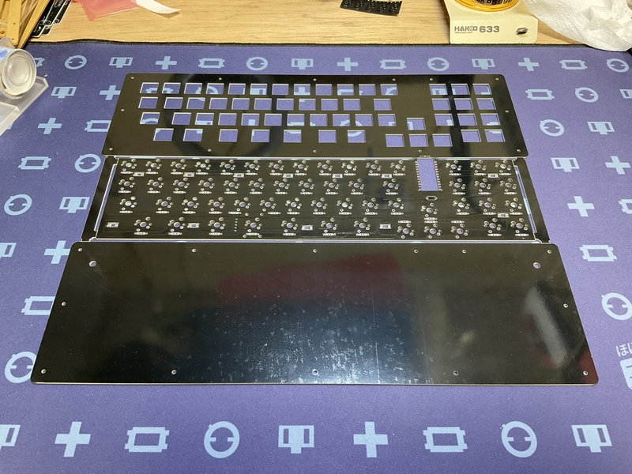

Please cut.
 
切り離してください。
 
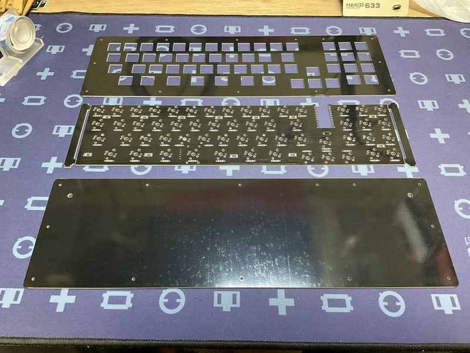
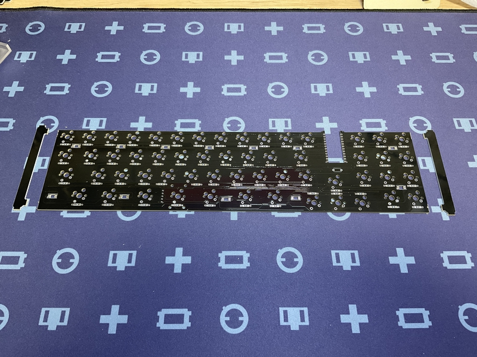

### 2 Diode soldering

Solder the diode on the back side.
 
裏面にダイオードのハンダ付けをします。
 

There are lead type and SMD diodes.
 
ダイオードはリードタイプか、SMDがあります。
 
Here, we will explain the lead type soldering.
 
ここでは、リードタイプのハンダ付けの説明をします。
 
However, those who adopt the choc switch should use SMD diodes.
 
ただし、chocスイッチを採用する人は、SMDのダイオードを使用してください。
 

Use a lead bender to bend the legs of the diode.
 
リードベンダーを使い、ダイオードの足を曲げます。
 

Insert the diode into the board.
 
ダイオードを基板に挿しこみます。
 

Please pay attention to the orientation of the diode.
 
ダイオードの向きに注意してください。
 

Secure the diode with masking tape, then face up.
 
マスキングテープでダイオードを固定してから、表面を上にします。
 
Solder the protruding legs.
 
はみ出ている足部分に、ハンダ付けをします。
 
After soldering, use nippers to cut off the protruding legs.
 
はんだ付けが終わったら、はみ出ている足をニッパーで切り取ってください。
 

[８倍速　Diodeハンダ付け動画](https://youtu.be/Yaodh2-XxV4)

 
 

## Case 1
If you use cool756 with hot swap, please proceed here.
 
cool756をホットスワップで使用する場合、こちらを進めてください。

### 3 Soldering switch sockets

Solder the switch sockets on the back side.
 
裏面にスイッチソケットのハンダ付けをします。
 
ここでは、cherryMXスイッチのハンダ付けを行います。
 
Place the switch socket so that the white silk is hidden.
 
白いシルクが隠れるように、スイッチソケットを乗せてください。
 
That is the correct switch socket orientation.
 
それが正しいスイッチソケットの向きになります。
 
When using a choc switch, place the switch socket so that the letters choc are hidden.
 

Apply solder to both pads.
 
両方のパッドにハンダを盛ります。
 
Place the switch socket and fix it with a warm soldering iron while melting the solder.
 
スイッチソケットを乗せて、温めたハンダゴテで、ハンダを溶かしながら、固定します。
 
You can make it easier by working while holding it with tweezers.
 
ピンセットで押さえながら、作業をすると楽にできます。
 

[８倍速　Switch socketハンダ付け動画](https://youtu.be/E__mHvmIXQo)

  

### 4 Pro micro

Solder the pro micro.
 
pro microのハンダ付けをします。
 
For cool756, in order to pursue thinness, the pro micro is attached directly to the board without using a pin header.
 
cool756では、薄さを求めるために、pro microをピンヘッダを使わずに、基板に直付けします。
 
Here, it is the surface with the USB terminal and parts of the pro micro.
 
ここでは、pro microのUSB端子や部品が付いている表面とします。
 
 
Install the pro micro surface facing the PCB side.
A part of the PCB is cut out so that the pro micro's USB terminal and parts do not interfere with the PCB.
 
pro microの表面がPCB側に向くよう取り付けます。
pro microのUSB端子や部品がPCBに干渉しないよう、PCBの一部が切り抜かれています。
 
Place the pro micro so that the "RAW" printed on the pro micro is on the numeric keypad side.
 
pro microの設置向きは、pro microの「RAW」の印字がテンキー側にしてください。
 
 
＜If you have a breadboardブレッドボードがある場合＞
 
The installation procedure is as follows.
 
取り付け方は次の手順になります。
 
①Insert the pin header into the breadboard, and pass the pin header through the pro micro with the surface facing the breadboard.
 
①ブレッドボードにピンヘッダを挿して、pro microの表面をブレッドボード側に向けて、ピンヘッダを通します。
 
② Solder from the back side of pro micro and fix the pin header.
 
②pro microの裏面からハンダ付けをして、ピンヘッダを固定します。
 
③Pull out the pro micro from the breadboard.
 
③ブレッドボードからpro microを抜きます。
 
④Remove the plastic attached to the pin header using radio pliers or the like.
 
④ピンヘッダに付いているプラスチックをラジオペンチ等を用いて、外します。
 
⑤ Insert so that the surface of pro micro faces the PCB side. Temporarily fix with masking tape.
 
⑤pro microの表面がPCB側に向くように、挿します。マスキングテープ等で仮固定します。
 
⑥ Solder from the opposite side of the PCB where the pro micro is inserted. Cut pins that are too long with nippers.
 
⑥pro microを挿したPCBの反対側からハンダ付けをします。長すぎるピンはニッパー等で切ってください。
 
 
＜If you don't have a breadboardブレッドボードがない場合＞
 

The installation procedure is as follows.
 
取り付け方は次の手順になります。
 
①Insert the pin header from the back of pro micro, then pro micro, then PCB.
Temporarily secure with masking tape.
 
①ピンヘッダをpro microの裏面から、pro micro、PCBの順で挿します。
マスキングテープで仮固定します。
 
②Solder the pin header from the PCB side.
 
②PCB側からピンヘッダをハンダ付けします。
 
③Remove the plastic pin header on the back of the pro micro using needle nose pliers.
 
③pro micro裏面のピンヘッダのプラスチックをラジオペンチ等を用いて、外します。
 
④Solder the back of the pro micro. Cut pins that are too long with nippers.
 
④pro microの裏面のハンダ付けをします。長すぎるピンはニッパー等で切ってください。
 
 

### 5　Test

Please write the firmware and check the operation.
 
ファームウェアを書き込んで、動作確認をしてください。
 

Install a switch or measure continuity with tweezers, etc.
 
スイッチを取り付けるか、ピンセット等で導通をはかるかを行います。
 
 

Firmware

[github](https://github.com/telzo2000/cool756/tree/main/firmware)

[remap](https://remap-keys.app/)

 
If you have a switch that doesn't respond, use a hot soldering iron to warm up the switch socket,diode and pro micro terminals.
 
もし、反応しないスイッチがあったら、温めたハンダゴテで、そのスイッチソケットやダイオード、pro microの端子を温めてください。
 
Also make sure the diode is oriented correctly.
 
また、ダイオードの向きが正しいか確認してください。
 

### 6 Installation of key switch

Plug the key switch into the switch plate and then into the switch socket on the PCB.
 
スイッチプレートにキースイッチを差し込み、そのあと、PCBのスイッチソケットに差し込んでください。
 
 

### 7 Bottom plate

Insert the M2 screw from the bottom surface of the bottom plate and tighten it with the M2 spacer on the top surface.
 
ボトムプレートの下面からM2ネジを差し込み、上面でM2スペーサーで締めてください。
 
13 locations.
 
13箇所行います。
 
 

### Option Middle plate

If you have the optional middle plate, please install the aluminum feet first.
 
オプションのミドルプレートがある場合、最初に、アルミ足を取り付けてください。
 
 
Next, stack the acrylic parts so that they pass through the bottom plate spacer.
 
次にボトムプレートのスペーサーを通すように、アクリル部品を重ねてください。
 

### 8 Finish

Place the switch plate and PCB on the bottom plate and tighten the 13 M2 screws.
 
ボトムプレートの上に、スイッチプレートとPCBを載せて、M2ネジで13箇所を締めてください。
 
 
ミドルプレート使用時 
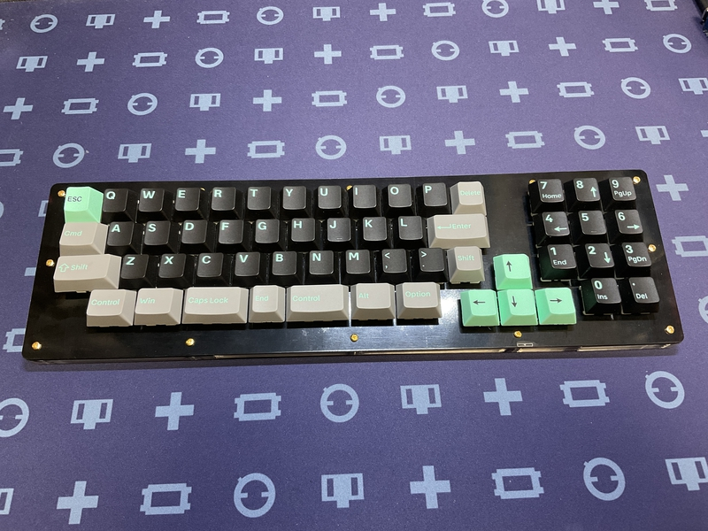

## Case2

If you want to solder directly without using a switch socket, proceed here.
 
スイッチソケットを使用せず、直接ハンダ付けをする場合は、こちらを進めてください。
 
 

### 3 Switch plate

Insert your favorite key switch from the top of the switch plate.
 
スイッチプレートの上面から、お好みのキースイッチを差し込んでください。
 

Note the orientation of the key switch.
 
キースイッチの向きに注意してください。
 
Good 
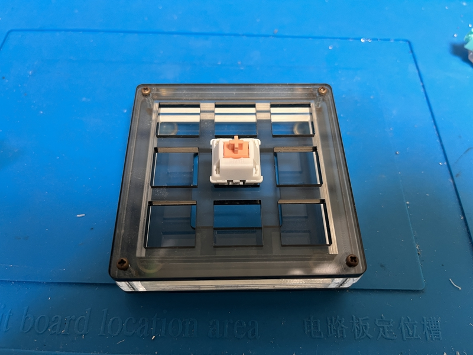
 
Not good 
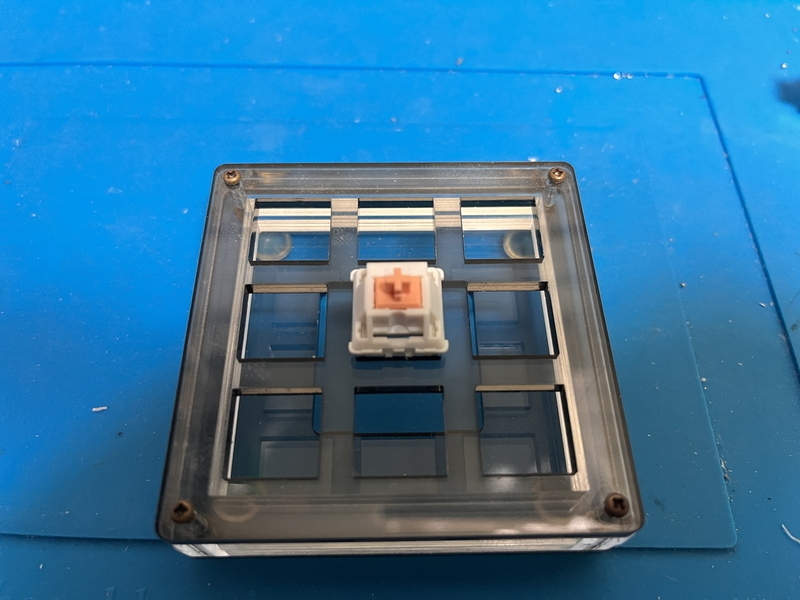

 
 

### 4 Pro micro

Solder the pro micro.
 
pro microのハンダ付けをします。
 
For cool756, in order to pursue thinness, the pro micro is attached directly to the board without using a pin header.
 
cool756では、薄さを求めるために、pro microをピンヘッダを使わずに、基板に直付けします。
 
Here, it is the surface with the USB terminal and parts of the pro micro.
 
ここでは、pro microのUSB端子や部品が付いている表面とします。
 
 
Install the pro micro surface facing the PCB side.
A part of the PCB is cut out so that the pro micro's USB terminal and parts do not interfere with the PCB.
 
pro microの表面がPCB側に向くよう取り付けます。
pro microのUSB端子や部品がPCBに干渉しないよう、PCBの一部が切り抜かれています。
 
Place the pro micro so that the "RAW" printed on the pro micro is on the numeric keypad side.
 
pro microの設置向きは、pro microの「RAW」の印字がテンキー側にしてください。
 
 
＜If you have a breadboardブレッドボードがある場合＞
 
The installation procedure is as follows.
 
取り付け方は次の手順になります。
 
①Insert the pin header into the breadboard, and pass the pin header through the pro micro with the surface facing the breadboard.
 
①ブレッドボードにピンヘッダを挿して、pro microの表面をブレッドボード側に向けて、ピンヘッダを通します。
 
② Solder from the back side of pro micro and fix the pin header.
 
②pro microの裏面からハンダ付けをして、ピンヘッダを固定します。
 
③Pull out the pro micro from the breadboard.
 
③ブレッドボードからpro microを抜きます。
 
④Remove the plastic attached to the pin header using radio pliers or the like.
 
④ピンヘッダに付いているプラスチックをラジオペンチ等を用いて、外します。
 
⑤ Insert so that the surface of pro micro faces the PCB side. Temporarily fix with masking tape.
 
⑤pro microの表面がPCB側に向くように、挿します。マスキングテープ等で仮固定します。
 
⑥ Solder from the opposite side of the PCB where the pro micro is inserted. Cut pins that are too long with nippers.
 
⑥pro microを挿したPCBの反対側からハンダ付けをします。長すぎるピンはニッパー等で切ってください。
 
 
＜If you don't have a breadboardブレッドボードがない場合＞
 

The installation procedure is as follows.
 
取り付け方は次の手順になります。
 
①Insert the pin header from the back of pro micro, then pro micro, then PCB.
Temporarily secure with masking tape.
 
①ピンヘッダをpro microの裏面から、pro micro、PCBの順で挿します。
マスキングテープで仮固定します。
 
②Solder the pin header from the PCB side.
 
②PCB側からピンヘッダをハンダ付けします。
 
③Remove the plastic pin header on the back of the pro micro using needle nose pliers.
 
③pro micro裏面のピンヘッダのプラスチックをラジオペンチ等を用いて、外します。
 
④Solder the back of the pro micro. Cut pins that are too long with nippers.
 
④pro microの裏面のハンダ付けをします。長すぎるピンはニッパー等で切ってください。
 
 

### 5　Test

Please write the firmware and check the operation.
 
ファームウェアを書き込んで、動作確認をしてください。
 
Check for continuity with tweezers or the like.
 
ピンセット等で導通をはかるかを行います。
 
 

Firmware

[github](https://github.com/telzo2000/cool756/tree/main/firmware)

[remap](https://remap-keys.app/)

 
If you have a switch that doesn't respond, use a hot soldering iron to warm up the diode and pro micro terminals.
 
もし、反応しないスイッチがあったら、温めたハンダゴテで、ダイオードやpro microの端子を温めてください。
 
Also make sure the diode is oriented correctly.
 
また、ダイオードの向きが正しいか確認してください。
 
 

### 6 Soldering keyswitch

Turn the switch plate with the key switch upside down.
 
キースイッチの刺さったスイッチプレートを逆さの向きにします。
 
Stack the PCBs in the same way upside down.
 
同じ様に逆さの向きにしたPCBを重ねます。
 
 
Check to see if the key switch legs are sticking out of the PCB.
 
PCBからキースイッチの足が出ているか確認してください。
 
If it's OK, solder all the key switch legs and PCB terminals.
 
問題ないのであれば、全てのキースイッチの足とPCBの端子をはんだ付けします。
 

### 7 Bottom plate

Insert the M2 screw from the bottom surface of the bottom plate and tighten it with the M2 spacer on the top surface.
 
ボトムプレートの下面からM2ネジを差し込み、上面でM2スペーサーで締めてください。
 
13 locations.
 
13箇所行います。
 
 

### Option Middle plate

If you have the optional middle plate, please install the aluminum feet first.
 
オプションのミドルプレートがある場合、最初に、アルミ足を取り付けてください。
 
 
Next, stack the acrylic parts so that they pass through the bottom plate spacer.
 
次にボトムプレートのスペーサーを通すように、アクリル部品を重ねてください。
 

### 8 Finish

Place the switch plate and PCB on the bottom plate and tighten the 13 M2 screws.
 
ボトムプレートの上に、スイッチプレートとPCBを載せて、M2ネジで13箇所を締めてください。
 
 
ミドルプレート使用時 

### Option  Installing PIM447 Trackball

A PIM447trackball can be attached to the cool756.
  
cool756に、PIM447trackballを取り付けることができます。
 
 
In addition to PIM447, four M2 screws 8mm (low head screws), eight M2 nuts, and a pin header are required.
  
PIM447との他に、M2ネジ8mm４本（低頭ネジ）、M2ナット８個、ピンヘッダが必要となります。
  
上からネジを差し込み、下でナットを締めます。 
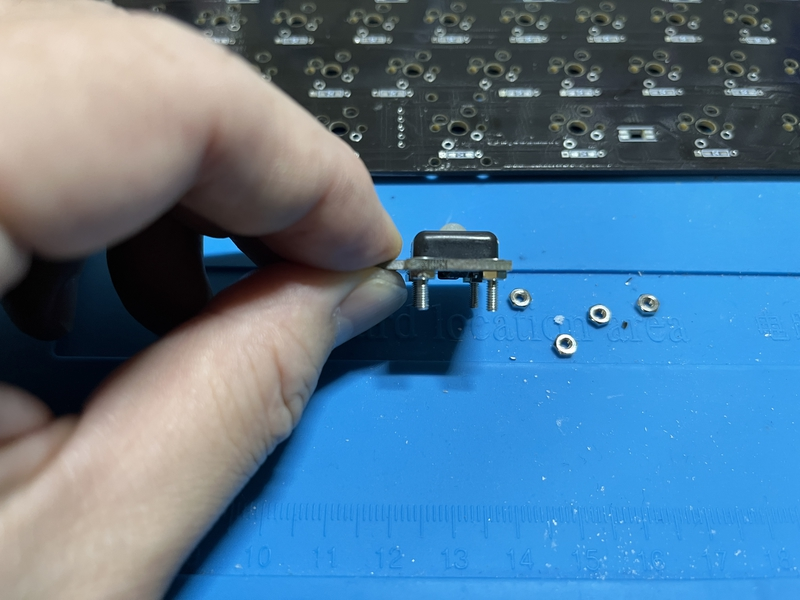
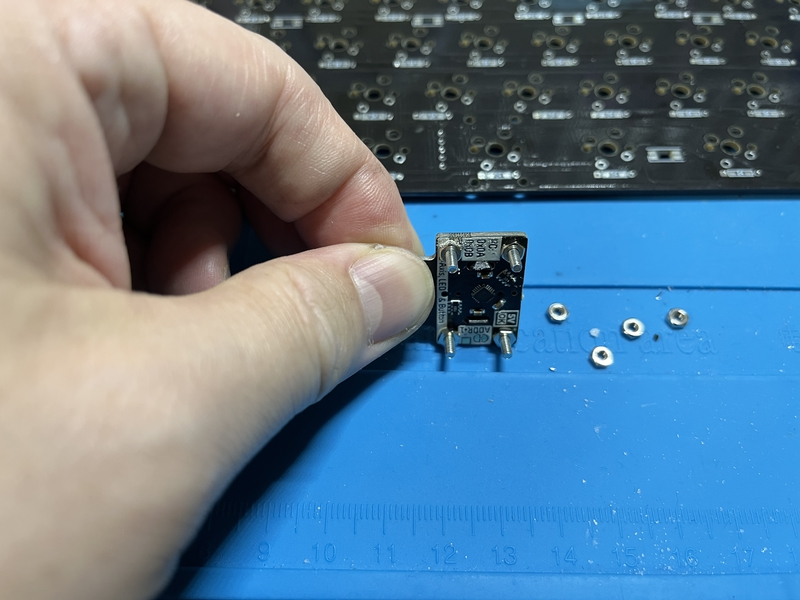

PCBに差し込んで、その下からナットを締めます。 
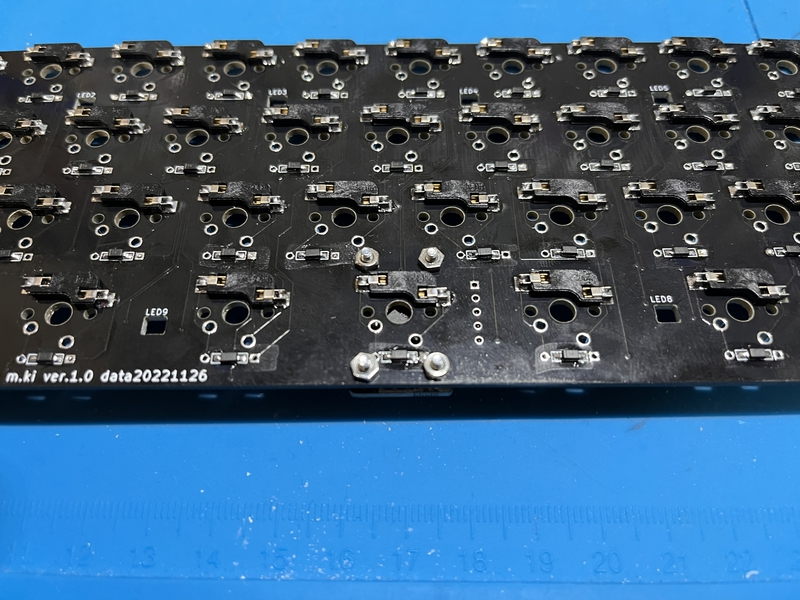
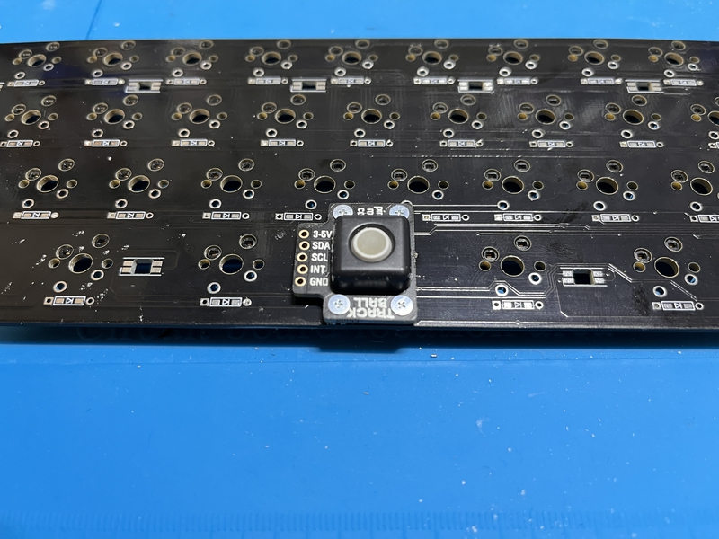

ピンの長さを調節して、差し込んではんだ付けをします。 
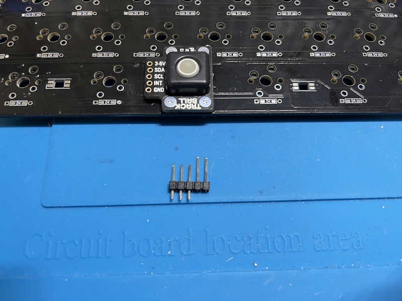
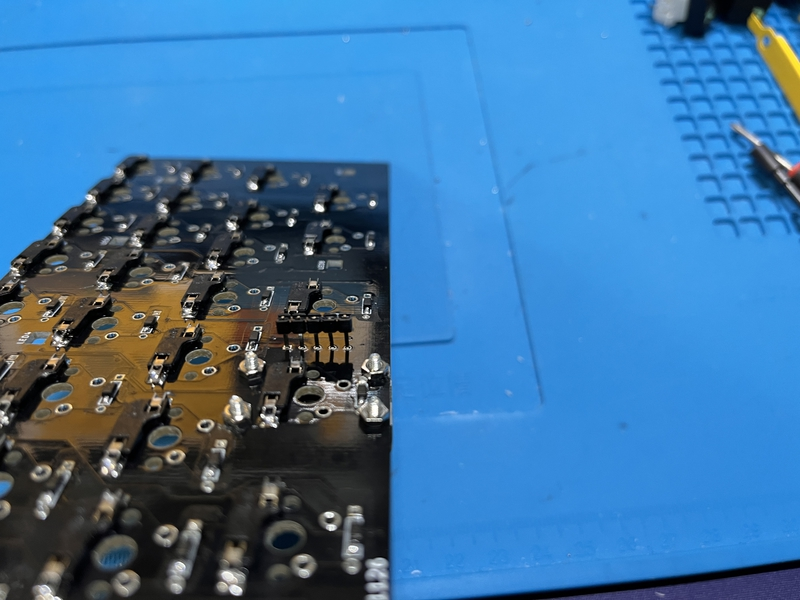

スイッチプレートを被せると、このようになります。 
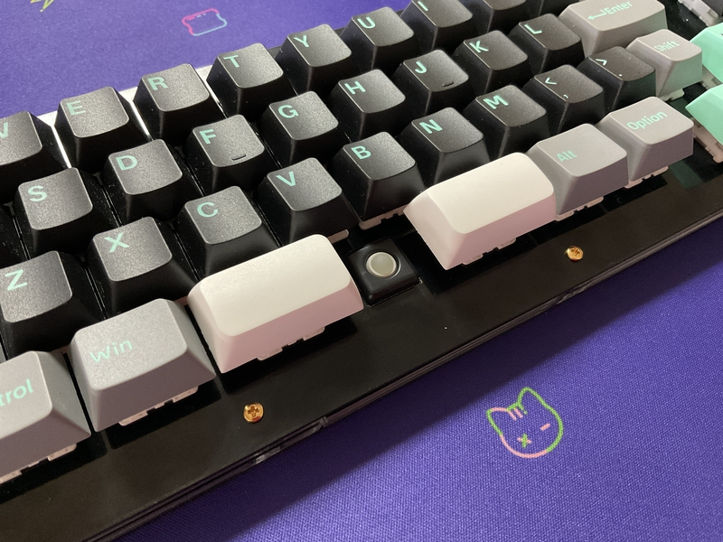
 
 

Have a fun selfmade keyboard life!
 
楽しい自作キーボード生活を! 

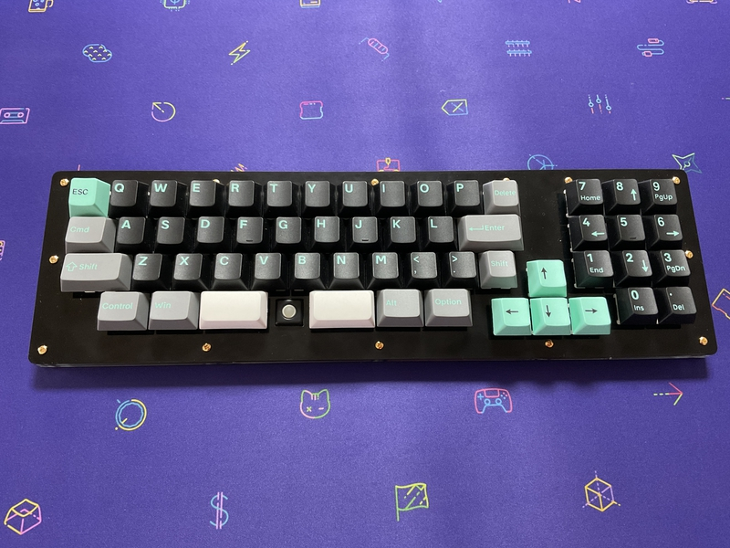

